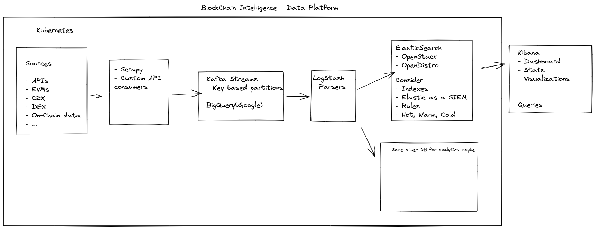

# BlockChain-Intelligence
Building few ideas on the intersection of Data Science x AI x Blockchain in public.

This repository is for the purpose of building on ideas, and practice knowledge related to the intersection of Data Science x AI x Blockchain.

- BlockChain Intel 
- BlockChain data
- Fraud detection
- On-Chain Analysis
- Liquidity prediction
- Ransom Tracking

## System Design

BlockChain intelligence Data Platform

  

